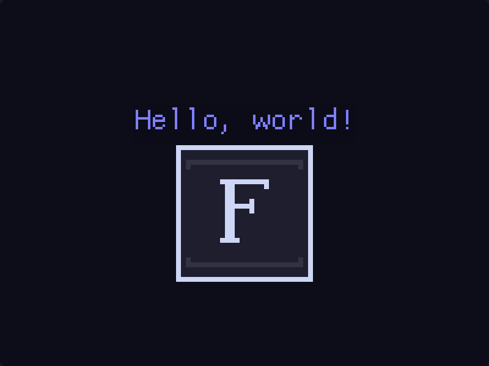

# Flowquad!
Flowquad is a library that helps you build UI stuff with [Macroquad](https://macroquad.rs)

# Features
- [x] UI Elements (Widgets)
  - [x] Button
  - [x] Container
  - [x] Label
  - [x] TextInput
  - [x] Toggle

# Getting Started

## Installation
Run
```bash
$ cargo add flowquad
```

## Example
A simple hello world with a label and an image.
```rust
use macroquad::prelude::*;
use flowquad::prelude::*;

#[macroquad::main("Flowquad Example")]
async fn main() {
    let mut label = Label::new("Hello, world!".to_string(), Color::new(0.05, 0.05, 0.1, 1.0), Color::new(0.5, 0.5, 1.0, 1.0), None, 64.0);
    let flowquad = load_texture("examples/flowquad.png").await.unwrap();
    flowquad.set_filter(FilterMode::Nearest);
    let mut image = flowquad::widgets::image::Image::new(256.0, 256.0, flowquad);

    loop {
        clear_background(Color::new(0.05, 0.05, 0.1, 1.0));

        // `Label::update` Does nothing but kept here for consistency
        label.update(screen_width() / 2.0 - label.width() / 2.0, screen_height() / 2.0 - label.height() / 2.0 - 100.0);
        label.render(screen_width() / 2.0 - label.width() / 2.0, screen_height() / 2.0 - label.height() / 2.0 - 100.0);
        image.update(screen_width() / 2.0 - image.width() / 2.0, screen_height() / 2.0 - image.height() / 2.0 + 50.0);
        image.render(screen_width() / 2.0 - image.width() / 2.0, screen_height() / 2.0 - image.height() / 2.0 + 50.0);

        next_frame().await;
    }
}
```
The result is:


More examples can be found in the `examples` folder.
```bash
$ cargo run --example <example_name>
```
